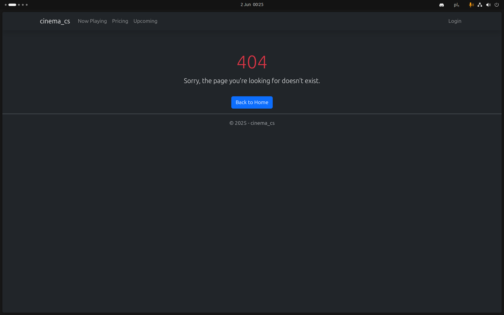

# 🎬 Cinema Management Web App

Aplikacja webowa do zarządzania kinem — napisana w ASP.NET Core Razor Pages z wykorzystaniem Bootstrap, Identity, PostgreSQL i Docker.

## ⚙️ Uruchamianie

1. **Zbuduj i uruchom kontener z bazą danych**:

   ```bash
   docker-compose up -d
   ```

2. **Uruchom aplikację**:

   ```bash
   dotnet run
   ```

✅ Migracje i seedowanie danych wykonują się automatycznie przy starcie aplikacji.

---

## 📁 Struktura Stron

```
Pages/
├── Account
│   ├── Index.cshtml           # Dane użytkownika
│   ├── Tickets.cshtml         # Zakupione biletów
│   └── AccessDenied.cshtml    # Dostęp zabroniony
├── Admin
│   ├── Movies.cshtml          # Zarządzanie filmami
│   ├── Screenings.cshtml      # Zarządzanie seansami
│   └── Users.cshtml           # Zarządzanie kontami
├── Login.cshtml               # Logowanie
├── Register.cshtml            # Rejestracja
├── Pricing.cshtml             # Cennik
├── Screening.cshtml           # Rezerwacja seansu
├── Upcoming.cshtml            # Nadchodzące filmy
├── Error404.cshtml            # Strona błędu 404
└── Shared/_Layout.cshtml      # Layout aplikacji
```

---

## 🔑 Uwierzytelnianie i Role

* Rejestracja/logowanie użytkownika
* Panel konta (`/Account/Index`) z edycją danych
* Role:

  * `User` – klient
  * `Admin` – dostęp do panelu administracyjnego

---

## 🧩 Technologie

* **ASP.NET Core Razor Pages**
* **Bootstrap 5**
* **PostgreSQL** (z Dockerem)
* **Entity Framework Core** + migracje + seedowanie
* **ASP.NET Identity**

---

Jasne! Poniżej znajduje się zaktualizowana sekcja ze zrzutami ekranu — z podziałem na kategorie, gdzie **każdy screen zajmuje pełną szerokość**, a **opis znajduje się pod obrazem**. To rozwiązanie świetnie sprawdzi się na GitHubie lub w plikach Markdown renderowanych w przeglądarce.

---

## 🖼️ Zrzuty Ekranu

### 🔐 Uwierzytelnianie


**Ekran logowania użytkownika**

---


**Komunikat o wymaganym zalogowaniu do uzyskania dostępu**

---


**Nieudana próba logowania z błędnymi danymi**

---


**Formularz rejestracji nowego użytkownika**

---


**Walidacja pól obowiązkowych podczas rejestracji**

---

### 👤 Konto Użytkownika


**Panel użytkownika z możliwością edycji danych**

---


**Walidacja pól obowiązkowych w panelu konta**

---


**Lista zakupionych biletów przypisanych do konta**

---

### 🎟️ Rezerwacja i Seanse


**Rezerwacja miejsc na wybrany seans filmowy**

---


**Komunikat o przekroczeniu limitu miejsc do rezerwacji**

---


**Brak dostępnych seansów dla wybranego filmu**

---

### 🏷️ Strony Ogólne


**Strona główna aplikacji z listą filmów i dostępnych seansów**

---


**Cennik biletów**

---


**Lista nadchodzących premier filmowych**

---


**Strona błędu 404 – brak zasobu**

---


**Ekran informujący o braku uprawnień (403)**

---

### 🛠️ Panel Administratora


**Menu administratora dostępne po zalogowaniu**

---


**Lista filmów z opcją dodawania, edytowania i usuwania**

---


**Formularz dodawania nowego filmu**

---


**Edycja danych filmu**

---


**Potwierdzenie usunięcia filmu**

---


**Zarządzanie seansami filmowymi**

---


**Edycja istniejącego seansu**

---


**Obsługa konfliktu – próba dodania seansu w zajętej sali**

---


**Filtrowanie seansów według filmu, sali lub daty**

---


**Zarządzanie kontami użytkowników – przegląd i filtrowanie**

---


**Edycja danych użytkownika przez administratora**

---


**Potwierdzenie usunięcia użytkownika**

---


**Filtrowanie kont użytkowników według e-maila, imienia, nazwiska i numeru telefonu**

---

## 📦 Docker & Baza Danych

Aplikacja korzysta z PostgreSQL uruchamianego w kontenerze.

### `docker-compose.yml`

Plik konfiguracyjny tworzy usługę `db`:

```yaml
version: '3.8'
services:
  db:
    image: postgres
    container_name: cinema_db
    environment:
      POSTGRES_USER: ...
      POSTGRES_PASSWORD: ...
      POSTGRES_DB: ...
    ports:
      - "5432:5432"
    volumes:
      - db-data:/var/lib/postgresql/data
volumes:
  db-data:
```

Po uruchomieniu aplikacja wykona migracje oraz zasieje bazę danymi początkowymi.

---

## 📌 Uwagi Końcowe

* W aplikacji obsługiwane są błędy 404 oraz brak dostępu
* W pełni responsywny interfejs dzięki Bootstrap 5
* Wszystkie formularze walidowane zarówno po stronie klienta, jak i serwera

